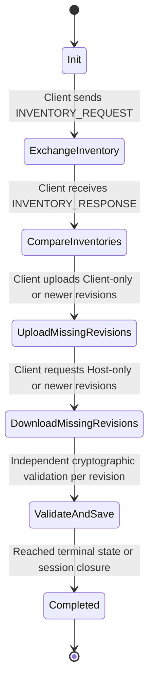

# SYN-005: Project-wide Reconciliation Protocol Design

This document details the bidirectional synchronization and reconciliation protocol (PRP1) for project-wide decision-record sync over a single authenticated Link session.

---

## 1. Protocol Architecture & Flow

To ensure simplicity, absolute safety, and deadlock avoidance, the Project Reconciliation Protocol (PRP1) uses a strictly sequential, client-orchestrated state machine. It runs over the existing transport-neutral Link application-stream seam.

### State Machine Diagram

### Protocol Sequence

1. **Inventory Request**: The client sends a request containing the project ID and its local inventory hash list.
2. **Inventory Response**: The host replies with its complete inventory of validated record heads.
3. **Reconciliation Mapping**: The client compares inventories and determines the delta (which records/revisions are missing, stale, ahead, or divergent).
4. **Bidirectional Transfer**:
   - **Upload Phase**: The client sequentially transfers contiguous missing revisions of records it has that are newer or absent on the host.
   - **Download Phase**: The client sequentially requests and receives contiguous missing revisions of records the host has that are newer or absent on the client.
5. **Session Teardown**: The client terminates the sync stream and outputs the reconciliation summary.

---

## 2. Message Schemas (PRP1)

PRP1 messages are binary-encoded using a dedicated magic prefix to isolate them from single-record SRP1 messages.

### Envelope Structure
- **MAGIC**: `32-bit integer` -> `0x50525031` ("PRP1" in ASCII).
- **VERSION**: `16-bit integer` -> `1`.
- **KIND**: `8-bit integer` -> `1` (Request), `2` (Response), `3` (Record Transfer), `4` (Reconcile Summary), `5` (Error).
- **PAYLOAD**: Variable-sized byte array containing payload matching the KIND.

### Message Payloads

#### 1. `INVENTORY_REQUEST`
- **Project ID**: `16 bytes` (UUID).
- **Record Count**: `32-bit integer`.
- **Entries**: Array of `[Record ID (16 bytes), Head Revision (64-bit long), Head Digest (32 bytes)]`.

#### 2. `INVENTORY_RESPONSE`
- **Project ID**: `16 bytes` (UUID).
- **Record Count**: `32-bit integer`.
- **Entries**: Array of `[Record ID (16 bytes), Head Revision (64-bit long), Head Digest (32 bytes)]`.

#### 3. `RECORD_TRANSFER`
- **Project ID**: `16 bytes` (UUID).
- **Record ID**: `16 bytes` (UUID).
- **Revision**: `64-bit long`.
- **Payload Size**: `32-bit integer`.
- **Signed Record Bytes**: Binary payload of the canonical signed SDR1 record.

#### 4. `RECONCILIATION_ERROR`
- **Error Code**: `16-bit integer` (e.g., `UNAUTHORIZED`, `BOUNDS_EXCEEDED`, `CONFLICT`).
- **Error Description**: Length-prefixed UTF-8 string.

---

## 3. Reconciliation Matrix

Upon comparing the inventories of Client (local) and Host (remote), each record ID is categorized into one of five states:

| Local Head (Client) | Remote Head (Host) | Relation / Action | Outcome / Target State |
| :--- | :--- | :--- | :--- |
| **Absent** | **Present (Rev R)** | Host-Only / Client requests download of revisions `1..R`. | **Reconciled (Applied)** |
| **Present (Rev C)** | **Absent** | Client-Only / Client uploads revisions `1..C`. | **Reconciled (Applied)** |
| **Present (Rev C)** | **Present (Rev H, C == H, digests match)** | Identical Heads / No action needed. | **Duplicate** |
| **Present (Rev C)** | **Present (Rev H, C < H, prefix matches)** | Stale Local / Client downloads revisions `C+1..H`. | **Reconciled (Applied)** |
| **Present (Rev C)** | **Present (Rev H, C > H, prefix matches)** | Ahead Local / Client uploads revisions `H+1..C`. | **Reconciled (Applied)** |
| **Present (Rev C)** | **Present (Rev H, digests mismatch)** | Divergent / Valid conflict quarantined locally. | **Quarantined Conflict** |

---

## 4. Ordering & Verification Rules

1. **Independent Sequential Verification**:
   - Revisions must be verified and saved in strict chronological order (e.g., if catching up from revision 1 to 3, revision 2 must be verified and saved successfully before revision 3 is processed).
   - If any revision fails verification (e.g., invalid signature or incorrect parent digest link), the sync for that specific record is aborted immediately, preserving the last known valid local state.
2. **Conflict Preservation**:
   - Divergent heads are never overwritten or deleted.
   - Valid conflicts (where both heads are authentic but divergent) are quarantined to local storage using the existing quarantine rules (moved to a quarantine subdirectory to prevent database pollution).
3. **Hard Bounds Enforcement**:
   - **Max Records per Inventory**: `1_000`.
   - **Max Revisions per Record**: `100`.
   - **Max Payload Size**: `10 MB` total per session to prevent DOS/OOM exhaustion.

---

## 5. Failure & Connection Loss Handling

- **Partial Progress**: If the connection drops mid-sync, all successfully verified and persisted records/revisions remain saved in local storage.
- **Reporting Outcome**: The CLI outputs the exact summary of what was successfully synced before the drop, and reports `SYNC_RESULT=PARTIAL_SUCCESS` on stdout, with exit code `10` indicating that the sync did not run to full completion.
- **Diagnostics**: Stderr receives `HINT=Connection lost. Run project sync again to resume.`

---

## 6. CLI & URI Parameter Integration

- **GUIDED URI Update**:
  - The guided URI generated by `sync host` drops the single record parameter when starting project-wide sync.
  - The new format is: `synesis://join/<signed-invitation-payload>?project=<PROJECT_UUID>&host=<HOST_NODE_ID>`
  - If B runs `sync join <URI>` with this link, the CLI detects that no `record` parameter is present and triggers the project-wide reconciliation sync automatically.
- **Backward Compatibility**:
  - If the URI contains a `record` parameter (manual single-record sync), the CLI falls back to the existing frozen SRP1 single-record sync to preserve exact backward compatibility.

---

## 7. Non-Goals & Non-Claims

- **Non-Goals**:
  - No automatic background sync, system watchers, or background daemons.
  - No peer discovery, automatic IP resolution, or NAT traversal.
  - No changes to standalone `:cli`. All work is integrated through `:workspace` commands.
- **Non-Claims**:
  - We do not claim eventual consistency guarantees across multiple peers (limited strictly to two authorized peers).
  - We do not claim protection against active physical network MITM attacks unless fingerprint confirmation (`--expect-host`) is validated out-of-band.
