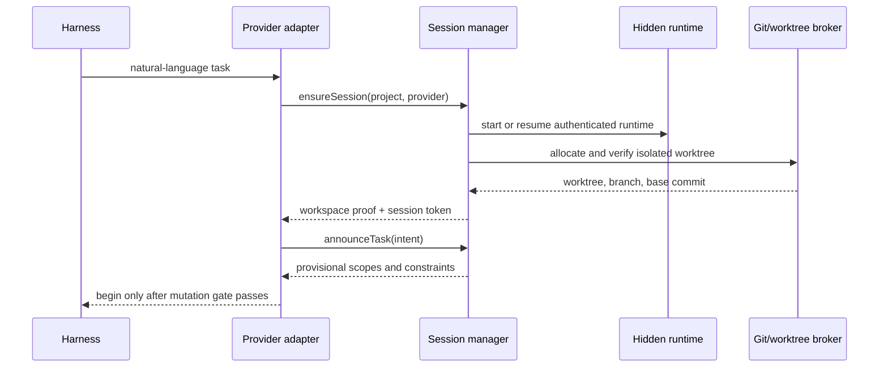

# Agent session bootstrap protocol

The provider-neutral operations are `ensureSession`, `announceTask`,
`updateIntent`, `evaluateAction`, `confirmCapabilityContract`,
`respondToOwnerRequest`, `reportImplementationReady`,
`validateIntegratedCapability`, and `completeTask`.

Every request carries project ID, session ID, node identity, provider ID,
idempotency key, observed event sequence, and base commit. Responses use stable
codes: `BOOTSTRAP_REQUIRED`, `RUNTIME_UNAVAILABLE`, `WORKSPACE_UNVERIFIED`,
`STALE_CONTEXT`, `DENY_POLICY`, `REQUEST_OWNER`,
`HUMAN_APPROVAL_REQUIRED`, `CONTRACT_REQUIRED`, `PENDING`, `READY`, and
`INTEGRATION_BLOCKED`.

## Bootstrap sequence

The provider must prove the harness is operating in the returned worktree. A
message telling an agent to `cd` is not proof. If the provider cannot switch or
cannot intercept its mutation tools, Synesis returns `WORKSPACE_UNVERIFIED` and
the agent remains read-only.

Before task intent, the local hook performs the durable project-session
bootstrap. The chain is `NodeIdentity -> project membership -> provider binding
-> supervisor actor -> worker actor -> task -> worktree`. The binding is written
to `.synesis/local/sessions/<provider>-<fingerprint>.json`, resumed only when
project/node/provider/fingerprint match, and refreshed atomically. Missing
provider evidence uses a per-project/provider nonce and is reported as fallback
evidence rather than a chat identity claim.

## Task intent and ownership

Intent includes purpose, semantic capabilities, expected scopes, base commit,
observed project sequence, acceptance commands, compatibility, concurrency, and
expiry. Ownership is capability/module/interface/task based. Concrete scopes
are enforcement evidence, not the ownership identity. Provisional claims become
active only after coordinator authorization and conflict evaluation.

## REQUEST_OWNER

The pre-mutation adapter stops the operation before any write and returns the
owner capability, node, supervisor, and intent version. The session manager
derives target, task, base evidence, scope hashes, and proposed behavior. The
agent confirms only fields that cannot be derived; the manager validates and
submits the existing bounded `PredictionContract`.
