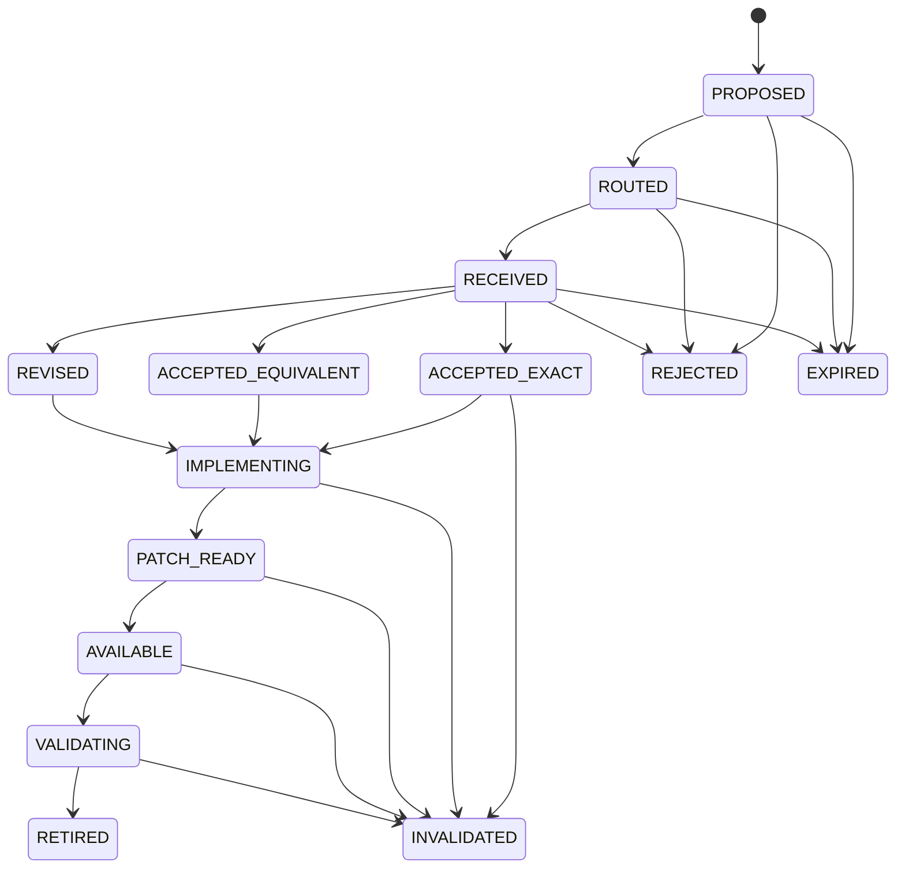

# Speculation state machines

## Prediction state



Terminal states are `RETIRED`, `INVALIDATED`, `REJECTED`, and `EXPIRED`.
Creation is the only event that can establish a prediction. Every later event
must be valid for the current state; the projection rejects impossible jumps.

## Provider decision precedence

```text
verified policy BLOCKED -> DENY_POLICY
missing/stale context    -> STALE_CONTEXT
owned by this node       -> ALLOW
owned by another node    -> REQUEST_OWNER
accepted prediction      -> SPECULATIVE_ALLOWED
patch/lease failure      -> structured retry or human escalation
```

The precedence prevents speculative coordination from bypassing existing
policy constraints.
