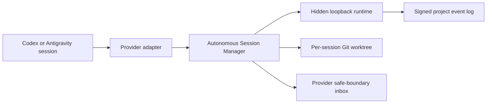

# Zero-touch autonomous harness collaboration

Status: proposed for SYN-013. Mode: EVOLUTION.

## Decision summary

Keep Synesis as a modular monolith with one project-local, loopback coordinator
and signed event log. Add an internal autonomous session manager in
`:coordination`; do not add a broker, database, remote service, or global agent.
Existing coordination commands remain diagnostic adapters. Provider integrations
call a small provider-neutral session API.

The product invariant is strict: after one `synesis init`, a human may open the
project normally in two supported harnesses, assign natural-language tasks, and
leave both agents working. A session may mutate only after identity, fresh
coordinator state, an allocated isolated worktree, and provider proof of the
active workspace and mutation interception all pass. Otherwise the harness is
read-only and the provider is not zero-touch-ready.

## Evidence ledger

| Capability | Classification | Evidence / gap |
|---|---|---|
| Signed coordination commands/events and replay | VERIFIED | `CoordinationService`, `PredictionEventStore`, CP-0144 evidence |
| Semantic ownership and `REQUEST_OWNER` | VERIFIED/PARTIAL | `OwnershipRegistry`, `ActionGuardrail`; no autonomous contract flow |
| Speculative worktree and fail-closed gate | VERIFIED | `SpeculationWorkspace`, `PredictionIntegrationGate` |
| Two-process coordination | DEMO_ONLY | `run-speculative-coordination-real.ps1` manually drives CLI |
| Project init and identity | PARTIAL | `ProjectApplicationService`, `InitCommand`; no ambient runtime/hooks/AGENTS contract |
| Codex mutation hook | PARTIAL/UNSAFE_TO_REUSE | synthetic tests pass; real trust/enforcement evidence missing |
| Antigravity mutation hook | UNSAFE_TO_REUSE | real protected edit changed the file; no hook invocation observed |
| Autonomous bootstrap, workspace transition, inbox delivery | MISSING | no provider capability evidence |

The missing identity link is now explicit and local: a provider hook loads the
project node identity, verifies project membership, and automatically binds a
provider-instance fingerprint to a durable session, supervisor, and worker
record. The machine/global Link identity remains separate diagnostic state;
the project profile is authoritative for project actions. This removes the
identity mismatch blocker without claiming real provider enforcement.

## Topology and ownership

The coordinator owns authorization, event order, task/ownership/prediction
projection, and lifecycle transitions. The session manager owns local process
state and worktree registration. The owner supervisor owns its implementation;
the requester owns its speculative consumer. Git remains durable source history.

## Security and failure invariants

Node identity, project ID, session ID, provider instance, task, worktree, and
branch are bound together and signed where they cross the coordinator boundary.
Role flags never grant ownership. Profile paths and worktrees must remain under
the project-local or configured user-local roots. No remote arbitrary command
execution or credential sharing is permitted.

Coordinator crash, stale cursor, or SSE loss reconnects from the last durable
cursor. Identity mismatch, event corruption, dirty/unregistered worktree,
missing hook proof, branch loss, contract mismatch, or failed validation fails
closed. An offline agent may continue only in its own verified scope.

## Alternatives rejected

PostgreSQL/broker/remote HTTPS add deployment and trust boundaries without
evidence. Permanent file locks conflate physical files with semantic ownership.
A global LLM creates an unnecessary authority and failure domain. AGENTS.md
instructions alone cannot prove a provider changed the active workspace.

## Invalidation conditions

Reconsider the topology only after measured local event-log limits, a real
multi-machine requirement, or a provider requiring a separate security/runtime
boundary. Do not promote either provider until the real workspace-transition and
pre-mutation gates pass.
