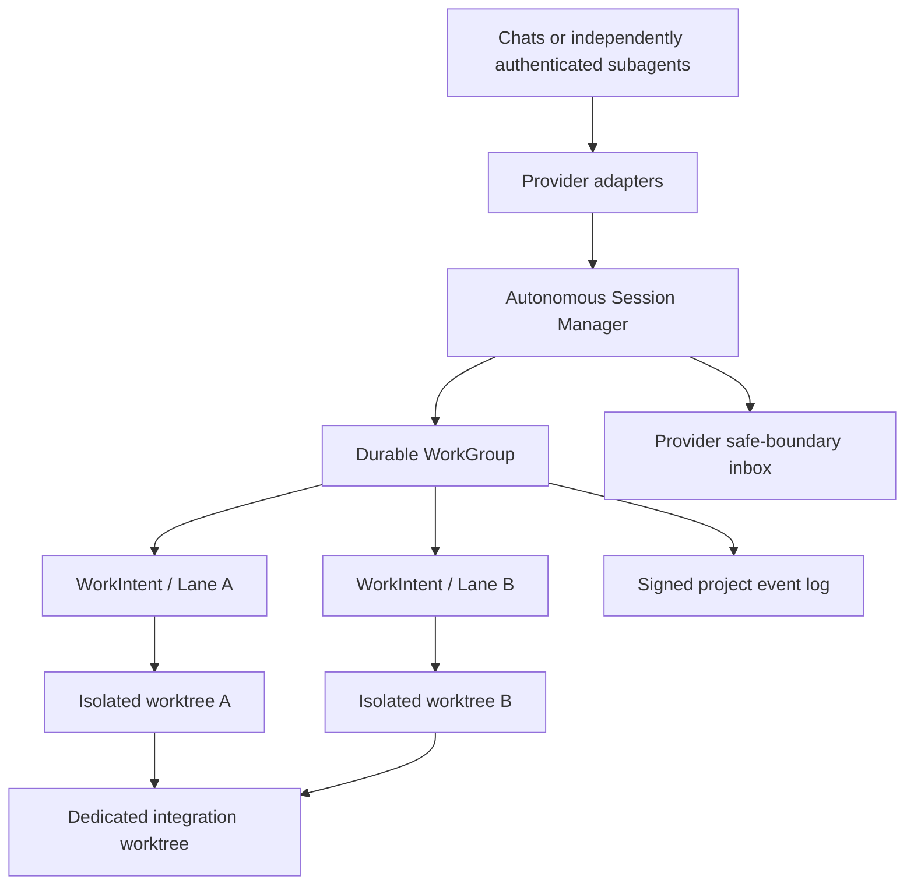

# Zero-touch autonomous harness collaboration

Status: proposed for SYN-013. Mode: EVOLUTION.

## Decision summary

Keep Synesis as a modular monolith with one project-local, loopback coordinator
and signed event log. Add an internal autonomous session manager in
`:coordination`; do not add a broker, database, remote service, or global agent.
Existing coordination commands remain diagnostic adapters. Provider integrations
call a small provider-neutral session API.

The product invariant is strict: after one `synesis init`, a human may open the
project normally in two supported harnesses, assign natural-language tasks, and
leave both agents working. A session may mutate only after identity, fresh
coordinator state, an allocated isolated worktree, and provider proof of the
active workspace and mutation interception all pass. Otherwise the harness is
read-only and the provider is not zero-touch-ready.

## Multi-chat logical workspaces

Synesis should support multiple chats working concurrently under one logical
work group, but they must not concurrently mutate one physical Git worktree.
The selected model is one durable `WorkGroup` with one isolated mutation lane
per chat or independently authenticated subagent. Each lane retains one
participant, provider binding, lease, claim epoch, branch, and physical
worktree. Claims are scoped to repository resources and must be non-overlapping
before mutation authority is granted.

`WorkIntent` remains a single-participant mutation lane. `WorkGroup` is the
logical parent that connects related intents, their shared goal and acceptance
criteria, declared contracts, immutable snapshots, and integration lineage.
The planned hierarchy is:

```text
Project
└── WorkGroup
    ├── WorkIntent / Lane A
    │   └── isolated worktree A
    ├── WorkIntent / Lane B
    │   └── isolated worktree B
    └── dedicated integration worktree
```

Chats do not share private LLM context. They share only durable coordination
state through the work group. Sibling lanes do not immediately see one
another's uncommitted filesystem changes; shared work becomes visible through
published immutable snapshots or a newly materialized lane generation.

Concurrent writers in one physical worktree are explicitly rejected. One-
writer handoff remains available for overlapping work, while separate work
groups remain available for unrelated or competing experiments.

## Evidence ledger

| Capability | Classification | Evidence / gap |
|---|---|---|
| Signed coordination commands/events and replay | VERIFIED | `CoordinationService`, `PredictionEventStore`, CP-0144 evidence |
| Semantic ownership and `REQUEST_OWNER` | VERIFIED/PARTIAL | `OwnershipRegistry`, `ActionGuardrail`; no autonomous contract flow |
| Speculative worktree and fail-closed gate | VERIFIED | `SpeculationWorkspace`, `PredictionIntegrationGate` |
| Two-process coordination | DEMO_ONLY | `run-speculative-coordination-real.ps1` manually drives CLI |
| Project init and identity | PARTIAL | `ProjectApplicationService`, `InitCommand`; no ambient runtime/hooks/AGENTS contract |
| Codex mutation hook | PARTIAL/UNSAFE_TO_REUSE | synthetic tests pass; real trust/enforcement evidence missing |
| Antigravity mutation hook | UNSAFE_TO_REUSE | real protected edit changed the file; no hook invocation observed |
| Autonomous bootstrap, workspace transition, inbox delivery | MISSING | no provider capability evidence |

The missing identity link is now explicit and local: a provider hook loads the
project node identity, verifies project membership, and automatically binds a
provider-instance fingerprint to a durable session, supervisor, and worker
record. The machine/global Link identity remains separate diagnostic state;
the project profile is authoritative for project actions. This removes the
identity mismatch blocker without claiming real provider enforcement.

## Topology and ownership



The coordinator owns authorization, event order, task/ownership/prediction
projection, and lifecycle transitions. The session manager owns local process
state and worktree registration. The owner supervisor owns its implementation;
the requester owns its speculative consumer. Git remains durable source history.

## Planned work-group concepts

The existing `WorkIntent` record remains the single-participant mutation lane.
The planned `WorkGroup` parent may be referenced by an optional versioned
`workGroupId` on each intent. Existing intents must replay as singleton work
groups, preserving the signed event history.

The implemented protocol foundation includes:

- `LaneGrant` for targeted joining by an already authenticated participant;
- single-use continuation grants for deliberately bouncing work between chats;
- delegated subagent lanes, each with its own binding and isolated worktree;
- lane-specific close and revocation, without closing the logical group;
- claim-epoch fencing for release, handoff, revocation, and recovery;
- a logical-group lifecycle that is independent from individual lane lifecycles.

`WorkGroupProjection` and `WorkGroupService` persist group and grant events;
single-use grants are target- and claim-epoch-checked. Full lane close/revoke
integration with every provider lifecycle remains a follow-up slice.

The currently supported enforced selectors remain exact repository paths and
repository path subtrees. Symbol claims are deferred until Synesis has an
enforceable language-aware selector model; they are not part of this plan's
implemented capability.

## Authority and mergeability prerequisites

Multi-chat collaboration is not safe until every authority-sensitive operation
resolves the exact calling connection rather than a provider's latest binding.
This prerequisite covers implementation publication, implementation
validation, capability requests and responses, collaboration operations, and
task completion or cancellation where applicable. Same-provider chats must
never act through one another's bindings.

Publication must include uncommitted lane changes in an immutable Synesis-owned
snapshot reference. The complete lane diff must be validated against the
lane's current claims before publication. Snapshot provenance must retain the
work-group ID, lane ID, base commit, claim epoch, changed paths, exact
contract revisions, and handoff lineage.

Integration must serialize across processes and evaluate both claims and
contracts. It must fail closed for stale epochs, stale contracts, uncovered or
unclaimed changes, incompatible bases, unresolved provenance, and detected
out-of-band mutations. Integration occurs only through a dedicated integration
worktree; it must not mutate the control checkout before all checks pass.

Exact-caller authority, dirty-lane snapshot materialization, immutable snapshot
refs, provenance encoding, claim-selector recording, provider-metadata
exclusion, and cross-process integration serialization are implemented. The
deterministic acceptance publishes two disjoint dirty lane snapshots and
integrates them in a dedicated worktree. Contract-revision and unresolved-
request rejection rules exist in the integration gate; broader regression
coverage and provider-lifecycle close/revocation wiring remain follow-up work.

## First parallel-collaboration milestone

The roadmap's first real parallel-collaboration milestone is isolated lanes
under one logical `WorkGroup`, not several chats sharing one physical
workspace. Acceptance requires that:

- two chats join one logical work group;
- each receives disjoint claims and an isolated worktree;
- both work concurrently and publish immutable snapshots;
- Synesis integrates the snapshots successfully;
- an overlapping claim grants mutation authority to exactly one lane;
- closing one lane does not close the work group or sibling lanes; and
- same-provider chats cannot act through one another's bindings.

Independent work groups remain the supported boundary for unrelated or
competing experiments. One-writer handoff remains the supported coordination
mode when work overlaps.

## Product boundary

Synesis coordinates and authenticates mutation lanes. It does not share or
manage private chat context, decide how agents reason, or determine whether
two implementations are semantically correct beyond declared contracts,
claims, provenance, and configured validation.

Synesis cannot portably prevent every shell, IDE, script, provider-native, or
external-tool write. Publication and integration must therefore fail closed
when unclaimed mutations are detected, while preserving the affected isolated
worktree for review or recovery.

## SYN-028 automated lifecycle and prerelease transition

SYN-028 makes lane lifecycle transitions durable and owner-independent while
preserving the multi-chat topology above. Verified process loss or quota
exhaustion fences the old binding and enters `SUSPENDED`; it never infers human
abandonment. `RECOVERY_HELD` is entered only after a complete immutable recovery
snapshot has been prepared and verified. The old scope remains reserved until
continuation, cancellation, revocation, or operator-authorized recovery.

Completion is an idempotent recoverable protocol transaction:

```text
prepare snapshot → verify claim-covered diff → durably commit completion
→ close lane and release claims
```

Failures retain the active lane and claims. A cancelled lane is permanently
fenced; its work is preserved as non-authoritative evidence and can re-enter
development only through explicit import or recovery into a new lane.

`get_next_action` is a non-destructive, at-least-once durable inbox. Retrieval
does not consume an item. Explicit acknowledgement or resolution references
the server-issued item ID, is exact-caller authorized, idempotent, and retains
stable ordering across provider or MCP crashes. Bounded inbox querying is
permitted when native wake-up is unavailable; blind mutation retries and busy
polling are not.

The managed Synesis Manual is installed globally by `synesis provider install`
in each provider's native skill directory. Session establishment attests its
ownership manifest, version, and content hash. Failed attestation blocks
authority-increasing operations, but still permits inspection, inbox reads,
own-lane closure or cancellation, claim relinquishment, diagnostics, and
operator-authorized recovery or revocation.

Prerelease migration is exclusive. It acquires a project migration lock,
refuses incompatible active writers, records durable phase markers, and resumes
or rolls back idempotently after interruption. Obsolete provider aliases,
obsolete MCP names and conversion-only readers are removed after conversion;
unrelated provider configuration is preserved and unsafe conversion fails
closed.

The MCP contract remains exactly 10 raw tools, using
`request_coordination`, `respond_coordination`, `publish_capability_implementation`,
`finish_lane`, and `cancel_lane` for the current coordination and lane surface.
Decorated MCP names are not accepted; only raw advertised names are valid.

## Security and failure invariants

Node identity, project ID, session ID, provider instance, task, worktree, and
branch are bound together and signed where they cross the coordinator boundary.
Role flags never grant ownership. Profile paths and worktrees must remain under
the project-local or configured user-local roots. No remote arbitrary command
execution or credential sharing is permitted.

Coordinator crash, stale cursor, or SSE loss reconnects from the last durable
cursor. Identity mismatch, event corruption, dirty/unregistered worktree,
missing hook proof, branch loss, contract mismatch, or failed validation fails
closed. An offline agent may continue only in its own verified scope.

## Alternatives rejected

PostgreSQL/broker/remote HTTPS add deployment and trust boundaries without
evidence. Permanent file locks conflate physical files with semantic ownership.
A global LLM creates an unnecessary authority and failure domain. AGENTS.md
instructions alone cannot prove a provider changed the active workspace.

## Invalidation conditions

Reconsider the topology only after measured local event-log limits, a real
multi-machine requirement, or a provider requiring a separate security/runtime
boundary. Do not promote either provider until the real workspace-transition and
pre-mutation gates pass.
